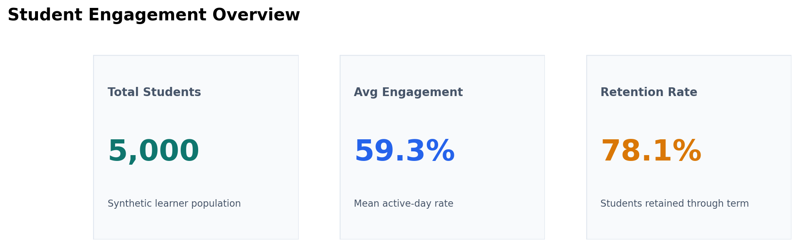
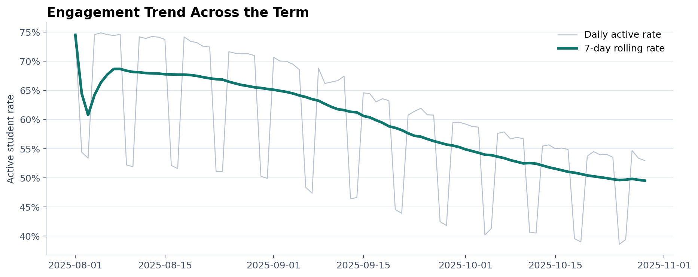
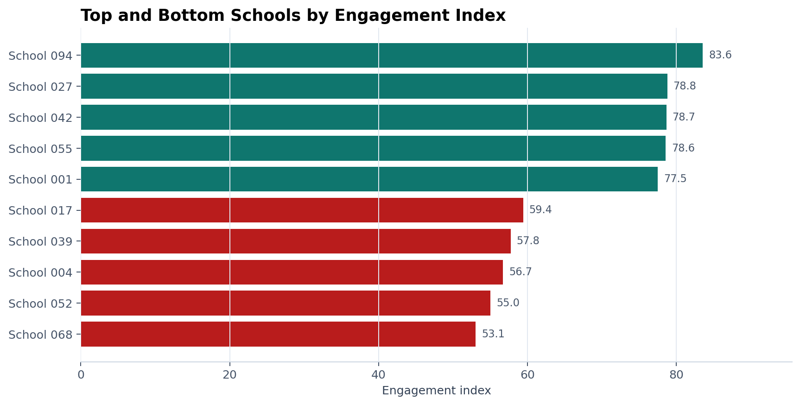
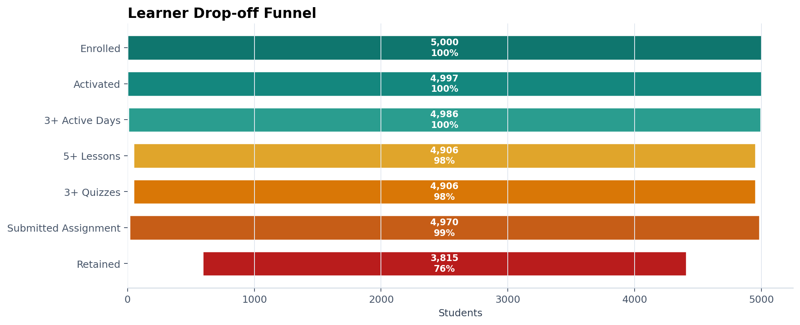
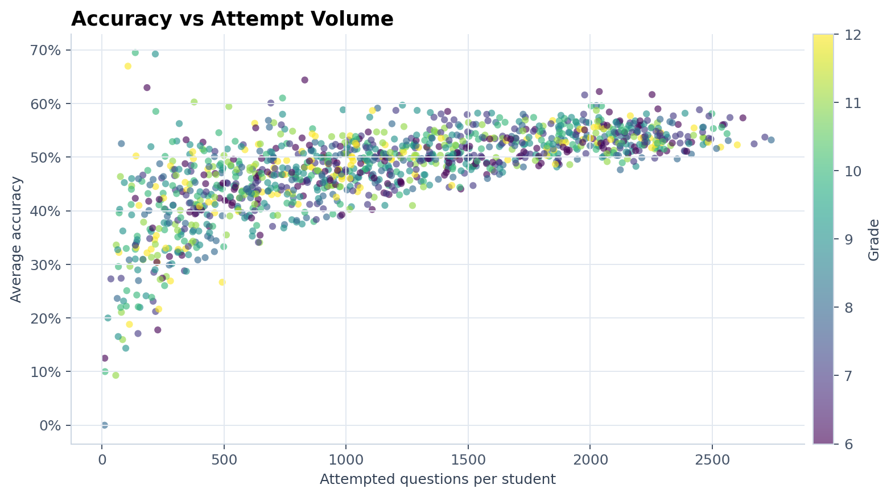

# Student Engagement Analytics System

An anonymized data analytics case study inspired by internship work in ed-tech operations. The project recreates the kind of engagement reporting system a school-success or academic operations team might use to monitor participation, find learner drop-offs, rank schools for support, and prepare Power BI reporting.

No employer data, student records, internal table names, proprietary metrics, or company identifiers are included. The dataset is fully synthetic and reproducible.

## What This Project Demonstrates

- Translating an ambiguous business problem into measurable engagement and retention metrics.
- Building a synthetic but realistic education dataset with 5,000 learners and 100 schools.
- Writing SQL for school ranking, retention cohorts, drop-off funnel analysis, and at-risk student queues.
- Cleaning raw data, engineering features, and creating explainable student segments in Python.
- Documenting a Power BI dashboard specification for operational decision-making.
- Communicating findings with caveats instead of overclaiming model accuracy.

## Business Problem

In a multi-school ed-tech program, engagement can decline before a learner formally drops out. Program teams need a repeatable way to answer:

- Which learners should be contacted this week?
- Which schools need additional implementation support?
- Where do learners drop out of the activation and retention funnel?
- Are access barriers, such as shared devices or poor internet, linked to lower engagement?
- Which metrics should leadership monitor weekly?

This repository turns those questions into a reproducible analytics workflow.

## Repository Structure

```text
.
├── data/
│   ├── schools.csv
│   ├── students.csv
│   ├── engagement_events.csv
│   ├── assessments.csv
│   ├── dataset_summary.csv
│   └── processed/
├── sql/
│   ├── 01_engagement_analysis.sql
│   ├── 02_school_ranking.sql
│   ├── 03_retention_analysis.sql
│   ├── 04_dropoff_funnel_analysis.sql
│   └── 05_at_risk_student_detection.sql
├── python/
│   ├── generate_data.py
│   ├── data_cleaning.py
│   ├── feature_engineering.py
│   ├── student_segmentation.py
│   ├── insight_generation.py
│   ├── generate_dashboard_assets.py
│   └── quality_checks.py
├── dashboard/
│   ├── dashboard_design.md
│   └── assets/
├── insights/
│   ├── key_findings.md
│   └── threshold_logic.md
├── README.md
├── requirements.txt
└── .gitignore
```

## Architecture

```text
Synthetic source data
        ↓
Data quality checks
        ↓
Cleaning and standardization
        ↓
Student-level feature table
        ↓
Explainable segmentation and risk scoring
        ↓
SQL analysis layer
        ↓
Power BI dashboard design
        ↓
Findings and recommendations
```

## How To Run

```bash
pip install -r requirements.txt
python python/generate_data.py
python python/quality_checks.py
python python/data_cleaning.py
python python/feature_engineering.py
python python/student_segmentation.py
python python/insight_generation.py
python python/generate_dashboard_assets.py
```

Expected generated scale:

- 5,000 students
- 100 schools
- At least 20 students per school
- Approximately 650k-750k engagement events
- Approximately 27k assessment records

## Dataset Schema

### `schools.csv`

| Column | Description |
|---|---|
| `school_id` | Anonymized school key |
| `school_name` | Synthetic school label |
| `region` | Synthetic operating region |
| `school_type` | Public, private, charter, or low-cost private |
| `urbanicity` | Urban, suburban, or rural |
| `teacher_student_ratio` | Staffing proxy |
| `digital_readiness_score` | Simulated readiness for digital delivery |
| `implementation_quality` | Simulated school-level execution quality |

### `students.csv`

| Column | Description |
|---|---|
| `student_id` | Anonymized learner key |
| `school_id` | School foreign key |
| `grade` | Grade 6-12 |
| `gender` | Synthetic demographic field |
| `socioeconomic_band` | Synthetic support-equity band |
| `device_access` | Device access category |
| `internet_quality` | Connectivity category |
| `enrollment_date` | Enrollment date within the term |
| `baseline_engagement_score` | Synthetic engagement propensity |
| `dropout_probability` | Generator probability, not a model output |
| `dropped_out` | Simulated term dropout flag |
| `dropout_day` | Simulated dropout day |
| `dropout_date` | Simulated dropout date |

### `engagement_events.csv`

| Column | Description |
|---|---|
| `event_id` | Engagement event key |
| `student_id` | Student foreign key |
| `school_id` | School foreign key |
| `event_date` | Activity date |
| `day_number` | Academic term day |
| `activity_type` | Lesson, quiz, assignment, video, or discussion |
| `minutes_spent` | Minutes spent in the activity |
| `content_items_completed` | Count of completed learning items |
| `correct_answers` | Correct question count |
| `attempted_questions` | Attempted question count |
| `accuracy_rate` | Correct answers divided by attempted questions |

### `assessments.csv`

| Column | Description |
|---|---|
| `student_id` | Student foreign key |
| `school_id` | School foreign key |
| `assessment_name` | Diagnostic, unit, midterm, or final assessment |
| `assessment_date` | Assessment date |
| `score` | Score out of 100 |
| `max_score` | Maximum score |
| `passed` | Pass flag |

## SQL Analysis Layer

The SQL scripts use PostgreSQL syntax and are written to be readable in a hiring review.

- `01_engagement_analysis.sql`: school-level active-day rate, recent activity, sessions, minutes, completions, and accuracy.
- `02_school_ranking.sql`: transparent engagement index with separate component points.
- `03_retention_analysis.sql`: enrollment-week cohorts with time-bound week 1, week 2, month 1, and final-month retention.
- `04_dropoff_funnel_analysis.sql`: activation-to-retention funnel with step-to-step conversion rates.
- `05_at_risk_student_detection.sql`: interpretable intervention queue with risk flags and recommended action.

## Python Pipeline

- `generate_data.py`: creates reproducible synthetic schools, students, events, and assessments.
- `quality_checks.py`: verifies row counts, school representation, referential integrity, ranges, and dropout-rate reasonableness.
- `data_cleaning.py`: standardizes dates, numeric fields, duplicates, and referential checks.
- `feature_engineering.py`: creates student-level engagement, assessment, recency, momentum, and risk features.
- `student_segmentation.py`: assigns explainable learner segments for operational outreach.
- `insight_generation.py`: generates school rankings and updates `insights/key_findings.md` from processed data.
- `generate_dashboard_assets.py`: creates static dashboard preview images from the processed dataset.

## Dashboard Overview

The Power BI specification contains five pages:

- Executive Overview
- Drop-off Funnel
- School Ranking
- At-Risk Students
- Segmentation

The dashboard is designed for weekly operating reviews. It favors metrics that lead to action, such as active-day rate, final-month retention, bottom-quartile schools, and high-risk learner counts.

See `dashboard/dashboard_design.md`.

## Dashboard Preview

These static images are generated from the processed dataset and mirror the intended Power BI dashboard pages.

### Executive KPI Overview



### Engagement Trend



### School Comparison



### Drop-off Funnel



### Accuracy vs Attempt Volume



## Operational Impact & Decision Enablement

This system is designed around weekly operating decisions, not passive reporting.

Program teams can use the outputs to:

- **Prioritize low-engagement schools:** Use the engagement index to identify bottom-quartile schools, then review active-day rate, retention, implementation quality, and high-risk learner count before assigning school-success coaching.
- **Target at-risk students:** Create weekly outreach lists for learners with declining engagement, 14+ inactive days, low pass rates, or high risk scores. The output separates re-engagement needs from academic-support needs.
- **Redesign weak learning moments:** Use funnel conversion by grade to identify where learners progress through activity stages but fail to retain, then review module length, assessment difficulty, and support prompts.
- **Allocate support capacity:** Compare high-risk learner counts across schools and grades so program managers can decide where to schedule teacher training, parent outreach, or tutoring blocks.
- **Monitor access barriers:** Review poor internet and shared-device segments as operational constraints. The intended action is additional support, low-bandwidth content, or offline reminders, not reduced service.
- **Improve weekly leadership reviews:** Shift the discussion from raw logins to active-day rate, final-month retention, school ranking movement, and the size of the intervention queue.

Example interventions:

- Bottom-quartile school with high dropout and low active-day rate: schedule implementation review, teacher enablement session, and weekly follow-up on active-day targets.
- Grade group with high assignment-to-retention drop-off: review assignment complexity and add scaffolded practice before the assignment stage.
- Learners with poor connectivity and declining engagement: send low-bandwidth reminders, offer offline completion options, and coordinate guardian outreach.
- Active learners with low assessment pass rates: route to academic support rather than standard re-engagement messaging.

## Assumptions and Limitations

- Data is synthetic and should not be used to infer real learner behavior.
- Dropout behavior is simulated from engagement propensity, access constraints, and school implementation quality.
- Risk scoring is rule-based and intended for explainability, not predictive-model claims.
- Socioeconomic and access fields are included for support-equity analysis. Any real deployment would require privacy, fairness, and governance review.
- The SQL uses PostgreSQL syntax. BigQuery, Snowflake, or SQL Server would require minor date and casting changes.
- The dashboard file is a Power BI design specification, not a `.pbix` file.

## Resume-Ready Summary

Built an anonymized student engagement analytics case study using Python, SQL, and Power BI design. Generated a reproducible dataset of 5,000 learners across 100 schools, engineered engagement and retention features, created school rankings and at-risk learner logic, and documented dashboard-ready insights for academic operations stakeholders.
